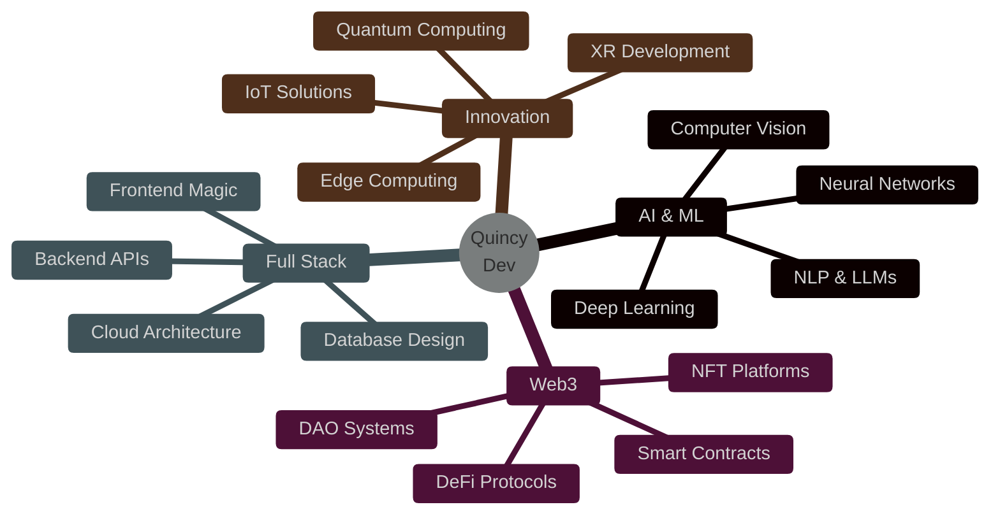

<div align="center">

<!-- Hero Banner with Gradient -->


<!-- Dynamic Typing Effect -->
<a href="https://git.io/typing-svg">
  
</a>

<br><br>

<!-- Social Stats Bar -->
<p>
  
  
  
</p>

</div>

<br>

<!-- Decorative Line -->


<br>

##  About Me


```javascript
const quincy = {
  pronouns: "He" | "Him",
  location: "Depok, West Java, Indonesia 🇮🇩",
  code: ["JavaScript", "TypeScript", "Python", "Rust", "Solidity"],
  askMeAbout: ["web dev", "AI/ML", "blockchain", "game dev"],
  technologies: {
    frontEnd: {
      js: ["React", "Next.js", "Vue"],
      css: ["Tailwind", "Bootstrap", "Styled Components"],
      3d: ["Three.js", "WebGL"]
    },
    backEnd: {
      js: ["Node.js", "Express", "NestJS"],
      python: ["FastAPI", "Django"],
      database: ["MongoDB", "PostgreSQL", "Redis"]
    },
    aiML: ["TensorFlow", "PyTorch", "OpenAI", "LangChain"],
    blockchain: ["Ethereum", "Solidity", "Web3.js", "Hardhat"],
    devOps: ["Docker", "Kubernetes", "GitHub Actions"],
    tools: ["VS Code", "Git", "Figma", "Blender"]
  },
  currentFocus: "Building AI-powered Web3 applications 🚀",
  funFact: "I turn coffee into code ☕ → 💻"
};
```

<br>

### 🎯 Quick Facts

- 🔭 Currently working on **AI-powered decentralized applications**
- 🌱 Learning **Quantum Computing** and **Advanced ML**
- 👯 Open to collaborate on **innovative open-source projects**
- 💬 Ask me about **Web Development, AI, Blockchain**
- 📫 Reach me: **antabogabotz@gmail.com**
- ⚡ Fun fact: **I debug in my sleep! 😴**

<br>

<!-- Decorative Line -->


<br>

##  Tech Stack

<div align="center">

### 💻 Languages


### 🎨 Frontend Development


### ⚙️ Backend Development


### 🗄️ Databases


### 🤖 AI/ML & Data Science


### ⛓️ Blockchain & Web3


### 🛠️ DevOps & Tools


### 🎮 Game & XR Development


</div>

<br>

<!-- Decorative Line -->


<br>

## 📊 GitHub Statistics

<div align="center">
  
  
  
  
</div>

<div align="center">
  
  
</div>

<br>

### 📈 Contribution Graph

<div align="center">
  
</div>

<br>

<!-- Decorative Line -->


<br>

## 🏆 GitHub Achievements

<div align="center">
  
</div>

<br>

<!-- Decorative Line -->


<br>

## 🚀 Featured Projects

<div align="center">

<table style="border: none;">
<tr>
<td width="50%" style="border: none;">
<h3 align="center">🎨 NeuroForge AI</h3>
<div align="center">
  <a href="https://github.com/quincy-dev/dalle-creator-image">
    
  </a>
  <br><br>
  <p align="center">
    
    
    
  </p>
  <p><strong>AI Image Generation Platform</strong><br>Real-time AI synthesis, neural style transfer, blockchain storage</p>
</div>
</td>

<td width="50%" style="border: none;">
<h3 align="center">🎮 Lexicon Nebula</h3>
<div align="center">
  <a href="https://github.com/quincy-dev/game-susun-kata">
    
  </a>
  <br><br>
  <p align="center">
    
    
    
  </p>
  <p><strong>Cognitive Word Puzzle Game</strong><br>Adaptive AI difficulty, multiplayer, NFT achievements</p>
</div>
</td>
</tr>

<tr>
<td width="50%" style="border: none;">
<h3 align="center">🌟 Stellar Portal</h3>
<div align="center">
  <a href="https://github.com/quincy-dev/home-template">
    
  </a>
  <br><br>
  <p align="center">
    
    
    
  </p>
  <p><strong>Immersive 3D Web Experience</strong><br>Three.js environment, particle animations, dynamic theming</p>
</div>
</td>

<td width="50%" style="border: none;">
<h3 align="center">📱 Media Singularity</h3>
<div align="center">
  <a href="https://github.com/quincy-dev/tiktok-downloader">
    
  </a>
  <br><br>
  <p align="center">
    
    
    
  </p>
  <p><strong>Smart Media Downloader</strong><br>One-click download, privacy-focused, multi-platform support</p>
</div>
</td>
</tr>
</table>

<br>

### 🔥 More Awesome Projects

<a href="https://github.com/quincy-dev?tab=repositories">
  
</a>

</div>

<br>

<!-- Decorative Line -->


<br>

## 🎯 What I'm Up To

<div align="center">



</div>

<br>

<!-- Decorative Line -->


<br>

## 🎵 Vibing To

<div align="center">
  
[](https://open.spotify.com/user/31l5bk775w4qizieczhe7mhc5wqi)

</div>

<br>

<!-- Decorative Line -->


<br>

## 🐍 Contribution Snake

<div align="center">
  


<p><i>⚠️ Setup GitHub Action untuk melihat snake animation - <a href="#setup-snake">Lihat panduan setup</a></i></p>

</div>

<br>

<!-- Decorative Line -->


<br>

## 💬 Random Dev Wisdom

<div align="center">


### 😄 Dev Humor


</div>

<br>

<!-- Decorative Line -->


<br>

## 📫 Connect With Me

<div align="center">

### 🌐 Let's Build Something Amazing Together!

<p>
  <a href="mailto:antabogabotz@gmail.com">
    
  </a>
  <a href="https://linkedin.com/in/quincy-dev">
    
  </a>
  <a href="https://twitter.com/quincy_dev">
    
  </a>
  <a href="https://instagram.com/quincy.dev">
    
  </a>
  <a href="https://discord.gg/quincydev">
    
  </a>
  <a href="https://t.me/quincy_dev">
    
  </a>
</p>

<br>

### 🤝 Open For

<table>
<tr>
<td align="center" width="25%">
  <br>
  <b>Collaborations</b><br>
  <sub>Let's work together!</sub>
</td>
<td align="center" width="25%">
  <br>
  <b>Freelance</b><br>
  <sub>Available for projects</sub>
</td>
<td align="center" width="25%">
  <br>
  <b>Mentorship</b><br>
  <sub>Happy to help!</sub>
</td>
<td align="center" width="25%">
  <br>
  <b>Innovation</b><br>
  <sub>Crazy ideas welcome!</sub>
</td>
</tr>
</table>

<br>

### 💖 Support My Work

<p>
  <a href="https://www.buymeacoffee.com/quincydev">
    
  </a>
  <a href="https://ko-fi.com/quincydev">
    
  </a>
  <a href="https://github.com/sponsors/quincy-dev">
    
  </a>
</p>

</div>

<br>

<!-- Decorative Line -->


<br>

<div align="center">

### 📊 Profile Stats


</div>

<br>

<!-- Decorative Line -->


<br>

<!-- Footer Wave -->


---

<div align="center">
  
### 💙 Made with Love and Coffee by Quincy Dev

**⚡ "Code is like humor. When you have to explain it, it's bad." – Cory House**

<p>
  
  
  
</p>

**© 2024 Quincy Dev. All Rights Reserved.**

</div>

---

</div>
