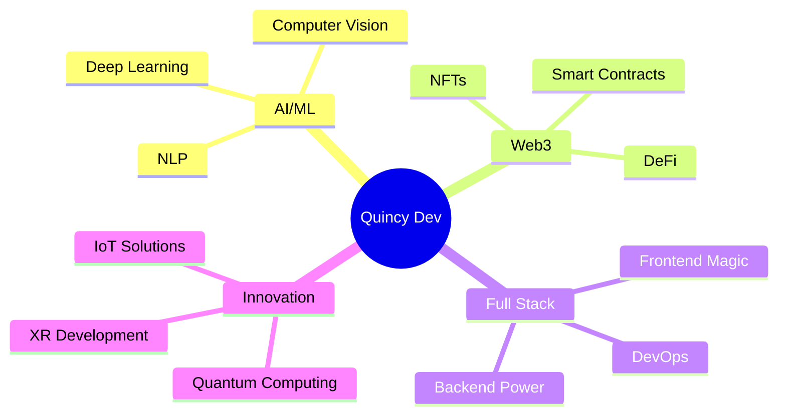

<div align="center">

<!-- Animated Header -->


<!-- Typing Animation -->
<a href="https://git.io/typing-svg"></a>

<!-- Animated Divider -->


</div>

## 🎯 About Me


```typescript
const quincy = {
    role: "Digital Architect & Innovation Engineer",
    location: "Depok, West Java 🇮🇩",
    currentFocus: [
        "🤖 AI/ML Engineering",
        "🌐 Web3 & Blockchain",
        "⚛️ Quantum Computing",
        "🎮 XR/Metaverse Development"
    ],
    languages: ["Indonesian", "English", "Japanese", "French"],
    lifePhilosophy: "Code is poetry, bugs are just plot twists 🎭",
    dailyRoutine: ["☕ Coffee", "💻 Code", "🎵 Music", "🔁 Repeat"],
    funFact: "I debug code faster than I debug my life 😄"
};
```

<br clear="right"/>

<!-- Animated Divider -->


## 🔥 Current Streak

<div align="center">
  
</div>

<!-- Animated Divider -->


## 💻 Tech Arsenal

<div align="center">

### 🚀 Languages & Frameworks

<p>


</p>

### 🎨 Frontend Technologies

<p>


</p>

### ⚙️ Backend & DevOps

<p>


</p>

### 🤖 AI/ML & Blockchain

<p>


</p>

### 🛠️ Tools & Platforms

<p>


</p>

</div>

<!-- Animated Divider -->


## 📊 GitHub Analytics

<div align="center">
  
  
</div>

<div align="center">
  
</div>

<!-- Animated Divider -->


## 🏆 GitHub Trophies

<div align="center">
  
</div>

<!-- Animated Divider -->


## 🚀 Featured Projects

<div align="center">

<table>
<tr>
<td width="50%">

### 🎨 NeuroForge AI
[](https://github.com/quincy-dev/dalle-creator-image)

**AI-Powered Image Generation Platform**
- 🤖 Real-time AI synthesis
- 🎨 Neural style transfer
- ⚡ Lightning-fast processing
- 🔒 Secure blockchain storage

</td>
<td width="50%">

### 🎮 Lexicon Nebula
[](https://github.com/quincy-dev/game-susun-kata)

**Cognitive Word Puzzle Game**
- 🧩 Adaptive difficulty AI
- 🌐 Multiplayer support
- 💎 NFT achievements
- 📊 Progress analytics

</td>
</tr>
<tr>
<td width="50%">

### 🌟 Stellar Portal
[](https://github.com/quincy-dev/home-template)

**Immersive 3D Web Experience**
- 🎭 Three.js environment
- ✨ Particle animations
- 🎨 Dynamic theming
- 📱 Fully responsive

</td>
<td width="50%">

### 📱 Media Singularity
[](https://github.com/quincy-dev/tiktok-downloader)

**Smart Media Downloader**
- ⚡ One-click download
- 🔒 Privacy-focused
- 🌐 Multi-platform support
- 💾 Auto-optimization

</td>
</tr>
</table>

</div>

<!-- Animated Divider -->


## 🎯 Current Focus

<div align="center">



</div>

<!-- Animated Divider -->


## 📫 Let's Connect

<div align="center">

### 💬 Reach Out & Collaborate

<p>
<a href="mailto:antabogabotz@gmail.com">
  
</a>
<a href="https://linkedin.com/in/quincy-dev">
  
</a>
<a href="https://twitter.com/quincy_dev">
  
</a>
<a href="https://github.com/quincy-dev">
  
</a>
</p>

### 🌟 Open For

<table>
<tr>
<td align="center">🚀<br><b>Collaborations</b></td>
<td align="center">💼<br><b>Freelance Work</b></td>
<td align="center">🎓<br><b>Mentorship</b></td>
<td align="center">💡<br><b>Innovation Projects</b></td>
</tr>
</table>

<br>


</div>

<!-- Animated Divider -->


<div align="center">

### 💭 Random Dev Quote


### 😄 And Here's a Dev Joke


</div>

<!-- Animated Divider -->


<div align="center">

### 🎵 Vibing To

[](https://spotify-github-profile.vercel.app/api/view?uid=31l5bk775w4qizieczhe7mhc5wqi&redirect=true)

</div>

<!-- Animated Divider -->


<div align="center">

## 🐍 Contribution Snake


</div>

<!-- Footer Wave -->


---

<div align="center">
  
### ⚡ *"First, solve the problem. Then, write the code."* – John Johnson

**Made with 💙 and ☕ by Quincy Dev**

</div>
